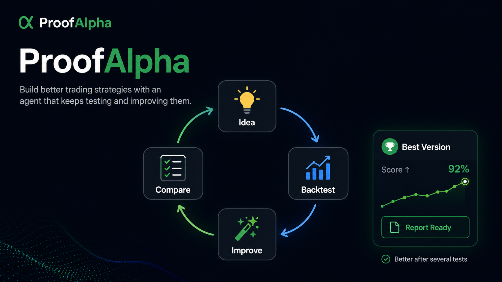
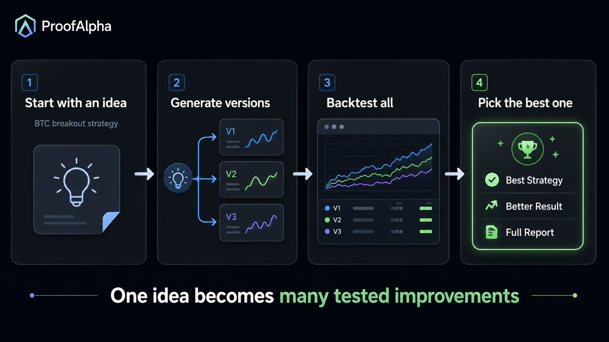

<p align="center">
  
</p>

<p align="center">
  
  
  
  
  
  
  <a href="https://github.com/marcus896/proofalpha/stargazers"></a>
</p>

# ProofAlpha

<!-- Legacy release-doctor compatibility strings: # Crypto Perps Stress Research Engine; python -m engine.app.cli run; python -m engine.app.cli doctor -->

**An AI agent that builds, backtests, and keeps improving crypto trading strategies — then hands you the best version with the evidence to back it up.**

ProofAlpha is more than a backtester. It is an autonomous research loop: give it a strategy idea, and the agent generates many variations, backtests each one against realistic market conditions, learns what works, and iterates — over and over — until it has a strong, well-tested candidate. You get the winning strategy plus a full, reproducible report.

```bash
python -m pip install -e .
proofalpha autoresearch \
  --config examples/minimal_builtin_study.json \
  --output-dir outputs/autoresearch \
  --db outputs/research-memory.sqlite
```

That single command kicks off the loop: generate → backtest → learn → improve → repeat.

## One idea becomes many tested improvements

<p align="center">
  
</p>

You bring a hypothesis. ProofAlpha does the heavy lifting:

1. **Start with an idea** — e.g. "BTC breakout strategy."
2. **Generate versions** — the agent composes and mutates strategy variants with bounded, budgeted search.
3. **Backtest all** — every variant is simulated with real-world frictions: fees, funding, slippage, latency, and partial fills.
4. **Pick the best one** — only candidates that survive walk-forward, stress, and overfit checks are promoted, with a full evidence report.

Then it keeps going. The loop remembers what it has already tried, avoids duplicates, and uses each result to propose better next steps.

## The improvement loop

The agent doesn't stop at one backtest. It runs a continuous **idea → backtest → improve → compare** cycle, getting stronger with every pass:

```text
        ┌─────────────────────────────────────────────┐
        │                                             │
   idea ─►  backtest ─►  improve ─►  compare ─► (best)─┘
        ▲                                             │
        └──────────── learn from memory ◄────────────┘
```

- **Bounded search** explores the strategy space efficiently instead of brute force.
- **Research memory** records every experiment so the loop builds on past results.
- **Promotion gates** make sure only genuinely strong candidates rise to the top.

## What you can do with it

- **Run the autonomous research loop** to discover and refine strategy candidates automatically.
- **Backtest with realistic costs** — fees, funding, slippage, latency, partial fills, and market impact.
- **Validate seriously** — walk-forward testing, stress scenarios, and overfit controls.
- **Paper trade with no keys** — replay public market data and simulate execution without any credentials.
- **Get auditable reports** — run cards, dashboards, and evidence cards you can review, compare, and trust.
- **Extend it with skills** — strategy composition, parameter sweeps, robustness validation, and campaign orchestration.

## Quick start

ProofAlpha runs on Python 3.12 and 3.13, in paper/no-key mode by default — no exchange credentials needed.

```bash
python -m pip install -e .
proofalpha doctor --format json

# Run the full agent research loop
proofalpha autoresearch \
  --config examples/minimal_builtin_study.json \
  --output-dir outputs/autoresearch \
  --db outputs/research-memory.sqlite

# Or run a single study end to end
proofalpha run \
  --config examples/minimal_builtin_study.json \
  --output-dir outputs/example-run
```

Prefer containers?

```bash
docker compose run --rm proofalpha
docker compose --profile demo run --rm demo
```

Run `proofalpha --help` for the full command surface, including `operate-loop`, `inspect-study`, and `strategy-evidence-card`.

## What you get out of every run

| Artifact | What it gives you |
| --- | --- |
| Run card | The clear keep/improve decision, with the reasons behind it. |
| Dashboard JSON | Structured metrics, validation results, and evidence. |
| Event log | A line-by-line trail of exactly what the agent did. |
| Research memory | Local history that powers smarter follow-up runs. |
| Evidence cards | Strategy summaries you can review and compare side by side. |

> Sometimes the best answer is "not yet." If a candidate doesn't clear the bar, ProofAlpha tells you why and keeps searching — so you only act on strategies that have earned it.

## Why you can trust the results

ProofAlpha is built so the answer means something. Every strategy is judged the same disciplined way a careful quant would judge it:

- realistic cost and execution modeling, not idealized fills;
- chronological, walk-forward validation that respects time;
- stress scenarios and overfit controls to catch fragile fits;
- explicit, reproducible artifacts that record data period, costs, and assumptions;
- a clean separation between research and live execution, so nothing trades real money just because a backtest looked good.

This is what turns "it looked great in a backtest" into "it held up under scrutiny."

## How it's built

```text
proofalpha              Distribution and console-script name
src/proofalpha          Public runtime adapter, version, and packaged skills
src/engine/agent        Research actions and the autonomous loop
src/engine/optimizer    Bounded search and experiment budgets
src/engine/backtest     Simulation, accounting, fills, and costs
src/engine/validation   Walk-forward, robustness, stress, and promotion gates
src/engine/memory       Experiment history and decision journals
```

See [`docs/ARCHITECTURE.md`](docs/ARCHITECTURE.md) for the full system design.

## Documentation

- [`docs/QUICKSTART.md`](docs/QUICKSTART.md) — install, first loop, and outputs.
- [`docs/DEMO.md`](docs/DEMO.md) — a guided safe demo.
- [`docs/ARCHITECTURE.md`](docs/ARCHITECTURE.md) — system design and components.
- [`docs/SECURITY_MODEL.md`](docs/SECURITY_MODEL.md) — trust boundaries and execution safety.
- [`ROADMAP.md`](ROADMAP.md) — where ProofAlpha is headed.

## Contributing

Contributions that improve strategy discovery, backtest realism, validation, data quality, developer experience, or documentation are very welcome. Read [`CONTRIBUTING.md`](CONTRIBUTING.md), [`GOVERNANCE.md`](GOVERNANCE.md), and [`ROADMAP.md`](ROADMAP.md).

## Verification

For release-impacting changes, run the full gate on a supported runtime:

```bash
python -m unittest discover -s tests -q
python -m compileall -q src tests scripts
python -m ruff check src --select F821,F811
python scripts/check_repository_secrets.py
python scripts/verify_public_export.py --root .
python -m pip_audit -r requirements-core.txt
proofalpha doctor --format json
proofalpha run --config examples/minimal_builtin_study.json --output-dir outputs/release-smoke
python -m build
```

The latest checkpoint passed 1,138 tests on Python 3.12 (2 skips), plus compile, targeted ruff, secret scan, export verification, dependency audit, doctor, a safe example run, and a package build.

---

## License, safety, and disclaimer

ProofAlpha is open source under the Apache License 2.0. Third-party notices are recorded in [`THIRD_PARTY_NOTICES.md`](THIRD_PARTY_NOTICES.md).

It is designed to be used responsibly:

- Paper and no-key execution are the public defaults; public examples submit no live orders.
- Strategy, agent, and model output is treated as untrusted and cannot silently change execution mode, credentials, risk limits, or validation policy.
- Live trading is always a separate, explicit decision — never granted automatically by a passing backtest.

ProofAlpha is software infrastructure for research and evidence. It is **not financial advice, not a broker or investment adviser, and not a guarantee of profit or returns.** Crypto and leveraged-derivatives trading carries substantial risk, including the risk of significant loss. Historical, simulated, and paper results do not guarantee future performance. Review [`DISCLAIMER.md`](DISCLAIMER.md), [`SECURITY.md`](SECURITY.md), and [`docs/SECURITY_MODEL.md`](docs/SECURITY_MODEL.md) before any real use.
