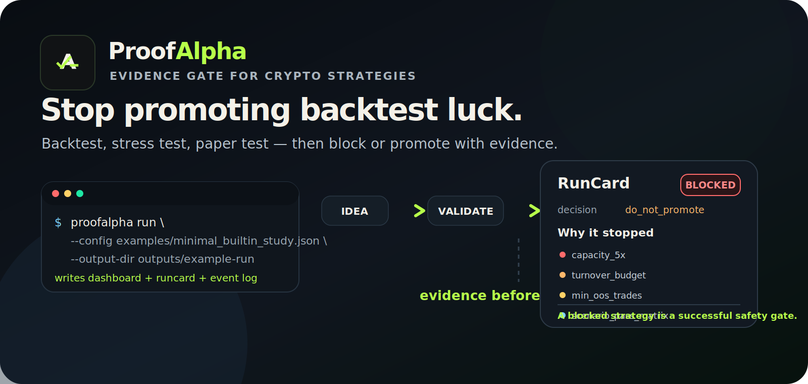
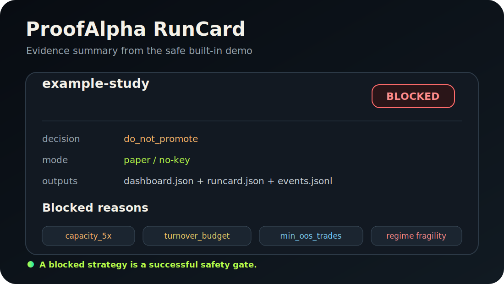

<p align="center">
  
</p>

<p align="center">
  <a href="https://github.com/marcus896/proofalpha/actions/workflows/tests.yml"></a>
  <a href="https://github.com/marcus896/proofalpha/actions/workflows/docs.yml"></a>
  <a href="https://github.com/marcus896/proofalpha/actions/workflows/security.yml"></a>
  
  
  
  
</p>

# ProofAlpha

<!-- Legacy release-doctor compatibility strings: # Crypto Perps Stress Research Engine; python -m engine.app.cli run; python -m engine.app.cli doctor -->

**Stop promoting backtest luck.**

ProofAlpha turns crypto strategy ideas into reproducible evidence: backtests, stress tests, paper/no-key runs, run cards, dashboards, and explicit block/promote decisions before money can move.

```bash
python -m pip install -e .
proofalpha run --config examples/minimal_builtin_study.json --output-dir outputs/example-run
```

Expected output:

```text
status: blocked
reason: weak evidence found
artifacts: dashboard.json + runcard.json + events.jsonl
```

A blocked strategy is a successful safety gate.

<p align="center">
  
</p>

> **Paper/no-key first.** Public examples require no exchange credentials and submit no live orders. Historical, simulated, and paper results do not guarantee future returns.

## Why ProofAlpha exists

Most trading bots make it too easy to jump from an idea to execution. ProofAlpha is designed around the opposite workflow:

```text
idea -> validated study -> stress tests -> paper evidence -> auditable decision -> gated execution readiness
```

It is built for developers, quants, and maintainers who want evidence before any execution authority. A failed or blocked strategy is useful: it can reveal weak evidence, insufficient data, excessive turnover, capacity risk, regime fragility, or another reason not to promote the candidate.

## 60-second safe demo

### Local Python

ProofAlpha supports Python 3.12 and 3.13.

```bash
python -m pip install -e .
proofalpha doctor --format json
proofalpha run \
  --config examples/minimal_builtin_study.json \
  --output-dir outputs/example-run
```

### Docker

```bash
docker compose run --rm proofalpha
docker compose --profile demo run --rm demo
```

The demo runs a checked-in research study, writes reproducible artifacts, and uses no private keys.

Expected artifacts:

```text
outputs/example-run/example-study.events.jsonl
outputs/example-run/example-study.runcard.json
outputs/example-run/example-study.dashboard.json
```

A demo may end as `blocked`; that is expected for weak evidence and shows the safety gates working.

## What ProofAlpha outputs

| Artifact | What it gives you |
| --- | --- |
| Event log | A line-by-line execution trail for auditability. |
| Run card | The human-readable block/promote decision and reasons. |
| Dashboard JSON | Structured metrics, validation results, and evidence payloads. |
| Research memory | Local history for bounded follow-up research and duplicate detection. |
| Evidence cards | Strategy evidence summaries for review before promotion. |

## What it includes

- data ingestion, schemas, provenance, snapshot storage, and quality checks;
- strategy DSL, catalog, lifecycle, intent contracts, and immutable artifacts;
- backtesting with fees, funding, slippage, latency, partial fills, and market impact;
- chronological validation, walk-forward testing, stress scenarios, overfit controls, and promotion gates;
- bounded candidate search and autonomous research loops;
- experiment memory, decision journals, event sourcing, and failure taxonomies;
- paper execution, public WebSocket capture, health checks, reconciliation, and TCA;
- portfolio allocation, risk budgeting, kill switches, mode guards, and execution policies;
- evidence dashboards, run cards, comparison reports, forecasting, learning, and optional MCP tools.

## What ProofAlpha is not

- not financial advice;
- not a broker or investment adviser;
- not a profit, income, win-rate, or risk-reduction guarantee;
- not a signal-selling project;
- not a way for model output to bypass risk policy.

## Core workflows

Inspect a study before execution:

```bash
proofalpha inspect-study --config examples/minimal_builtin_study.json
```

Run bounded autoresearch:

```bash
proofalpha autoresearch \
  --config examples/minimal_builtin_study.json \
  --output-dir outputs/autoresearch \
  --db outputs/research-memory.sqlite
```

Run the strict operator loop:

```bash
proofalpha operate-loop \
  --config examples/minimal_builtin_study.json \
  --output-dir outputs/operator-loop \
  --db outputs/operator-memory.sqlite \
  --profile strict_v3
```

Build a strategy evidence card from saved loop evidence:

```bash
proofalpha strategy-evidence-card --help
```

Run `proofalpha --help` for the full command surface.

## Safety boundary

- Paper and no-key execution paths are the public defaults.
- Public examples do not require private keys.
- Natural-language, agent, model, strategy, and plugin output is treated as untrusted input.
- Agent output cannot silently override execution mode, credentials, symbol scope, risk limits, or validation policy.
- Stale required market streams fail health checks.
- Risk state, reconciliation, idempotency, and kill-switch components are explicit.
- Live trading is a separate approval and deployment decision; it is not a profitability promise.
- Performance artifacts must identify data period, costs, assumptions, and whether results are historical, simulated, paper, or live.

Read [`SECURITY.md`](SECURITY.md), [`DISCLAIMER.md`](DISCLAIMER.md), and [`docs/SECURITY_MODEL.md`](docs/SECURITY_MODEL.md).

## Documentation

Start here:

- [`docs/QUICKSTART.md`](docs/QUICKSTART.md) - first run, outputs, and troubleshooting.
- [`docs/DEMO.md`](docs/DEMO.md) - safe demo walkthrough and expected blocked result.
- [`docs/ARCHITECTURE.md`](docs/ARCHITECTURE.md) - system design and major components.
- [`docs/SECURITY_MODEL.md`](docs/SECURITY_MODEL.md) - trust boundaries and execution safety.
- [`docs/OPEN_SOURCE_BOUNDARY.md`](docs/OPEN_SOURCE_BOUNDARY.md) - what belongs in the public repo.
- [`docs/RELEASE_CHECKLIST.md`](docs/RELEASE_CHECKLIST.md) - maintainer release and publish checklist.

## Verification

For release-impacting changes, run the full gate on a supported runtime:

```bash
python -m unittest discover -s tests -q
python -m compileall -q src tests scripts
python -m ruff check src --select F821,F811
python scripts/check_repository_secrets.py
python scripts/verify_public_export.py --root .
python -m pip_audit -r requirements-core.txt
proofalpha doctor --format json
proofalpha list-skills --format json
proofalpha run --config examples/minimal_builtin_study.json --output-dir outputs/release-smoke
python -m build
```

Latest local publish-readiness checkpoint: the published suite passed 1,138 tests on Python 3.12 with 2 skips, plus compile, targeted ruff, secret scan, export verification, dependency audit, doctor, safe example, and package build.

Pyright annotation cleanup remains technical debt and is not claimed as a passing release gate.

## Package layout

```text
proofalpha              Distribution and console-script name
src/proofalpha          Public runtime adapter, version, and packaged skills
src/engine              Byte-identical internal implementation package
```

The internal package remains named `engine` to avoid a high-risk branding-only import rewrite. Every published `src/engine` file is copied byte-for-byte and verified against its source SHA-256; the combined tree hash is recorded in `PUBLIC_EXPORT_MANIFEST.json`. The ProofAlpha adapter packages the same approved skill contracts so `list-skills`, autoresearch, and MCP skill discovery also work from an installed wheel.

## Brand

Original vector assets:

```text
assets/brand/proofalpha-mark.svg
assets/brand/proofalpha-wordmark.svg
assets/brand/proofalpha-hero.svg
assets/brand/github-social-preview.svg
assets/screenshots/runcard-blocked.svg
```

## Contributing

Contributions should improve correctness, reproducibility, safety, data quality, accounting realism, validation, developer experience, or documentation.

Profit screenshots and unverifiable strategy claims are not engineering evidence.

Read [`CONTRIBUTING.md`](CONTRIBUTING.md), [`GOVERNANCE.md`](GOVERNANCE.md), and [`ROADMAP.md`](ROADMAP.md).

## License and disclaimer

ProofAlpha is available under the Apache License 2.0. Third-party notices are recorded in [`THIRD_PARTY_NOTICES.md`](THIRD_PARTY_NOTICES.md).

ProofAlpha is software infrastructure, not financial advice, a broker, an investment adviser, or a guarantee of returns. Crypto and leveraged derivatives trading can result in substantial loss. Review [`DISCLAIMER.md`](DISCLAIMER.md) before use.
